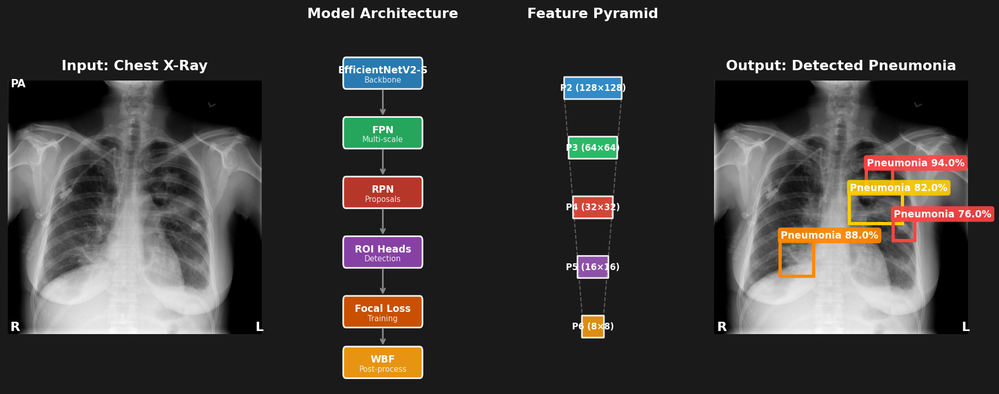
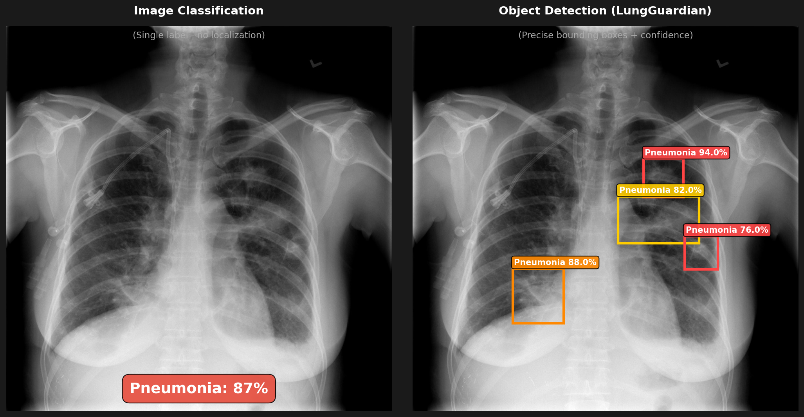
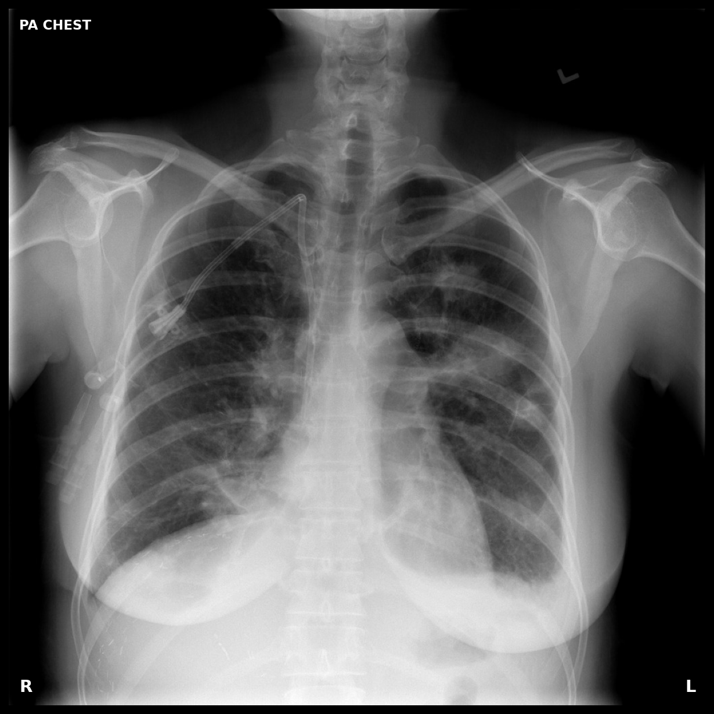
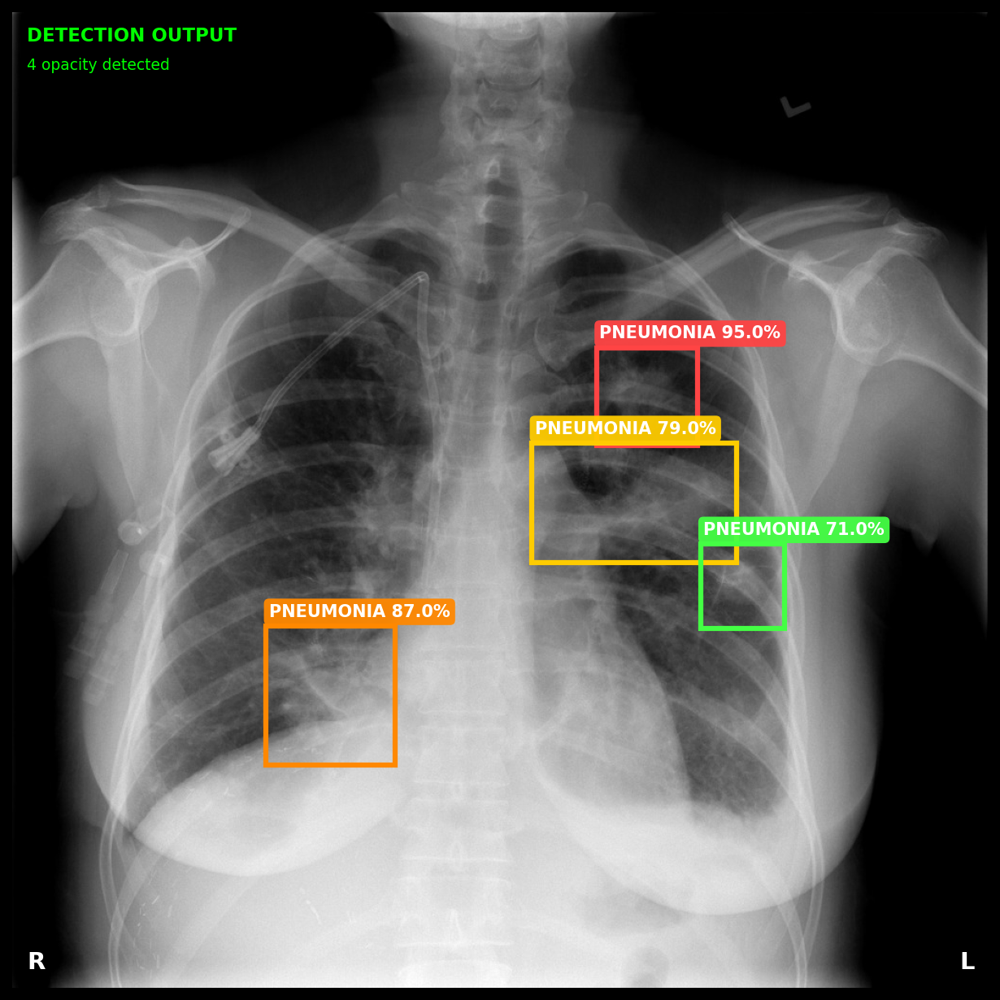
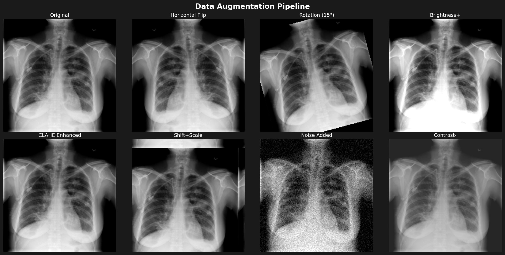

# 
Pneumonia detection from chest X-rays using Faster R-CNN with EfficientNetV2 backbone. Built for the [RSNA Pneumonia Detection Challenge](https://www.kaggle.com/c/rsna-pneumonia-detection-challenge).

## Abstract
 
Chest radiography is one of the most commonly performed diagnostic imaging studies [2], yet reading it for pneumonia is difficult: opacities range from small focal infiltrates to extensive consolidations, have ill-defined borders, and coexist with unrelated findings. An image-level classifier reports *whether* pneumonia may be present, but not *where*. This work treats pneumonia opacity **localisation** as an object-detection problem on the RSNA Pneumonia Detection dataset [1, 2].
 
The repository implements a two-stage, multi-scale detector: a Faster R-CNN [6] whose ImageNet-pretrained EfficientNetV2-S backbone [5] feeds a Feature Pyramid Network [7] with five pyramid levels and level-specific anchors from 32 to 512 px, so that opacities of very different extent are proposed and refined at appropriate resolutions. Around this model, the code provides a patient-level, class-stratified 5-fold cross-validation protocol, bounding-box-aware augmentation including mosaic [11], discriminative learning rates, mixed-precision training with gradient accumulation, Weighted Box Fusion [10] post-processing, and detection-specific evaluation utilities. This document describes the design, the experimental protocol and the current status of the project, including its known limitations.
 
**Highlights**
 
- **Multi-scale detector:** EfficientNetV2-S → FPN (256 channels, five levels) → RPN with per-level anchors (32–512 px) → multi-level RoIAlign → two-class box head.
- **Leakage-safe evaluation:** 5-fold `StratifiedGroupKFold`, grouped by `patientId` and stratified on the pneumonia label (seed 42).
- **Domain-aware augmentation:** flip, shift/scale/rotate, brightness/contrast/gamma, CLAHE, Gaussian noise, coarse dropout and 4-image mosaic, all with bounding-box-aware handling.
- **Stable fine-tuning:** three-tier discriminative learning rates, AdamW, linear warm-up + cosine schedule, AMP, gradient accumulation (effective batch 16), gradient clipping, early stopping, checkpoint/resume.
- **Detection-specific evaluation:** IoU/GIoU utilities, per-image AP and mAP over several IoU thresholds, Weighted Box Fusion for single-model and ensemble/TTA predictions.
<p align="center">
  
</p>

## What it does

This is an **object detection** model, not a classifier. It finds and localizes pneumonia opacities in chest X-rays with bounding boxes.

<p align="center">
  
</p>

| Input | Output |
|:-----:|:------:|
|  |  |

## 1. Tech stack

| Component | Choice | Why |
|-----------|--------|-----|
| Backbone | EfficientNetV2-S | Better accuracy/speed than ResNet |
| Detector | Faster R-CNN + FPN | Multi-scale detection |
| Loss | Focal Loss | Handles 95%+ background anchors |
| Post-processing | Weighted Box Fusion | Better than NMS for overlapping boxes |
| Augmentation | Albumentations + Mosaic | Robust to variations |
| CV Strategy | StratifiedGroupKFold | No patient leakage between folds |


## 2. Dataset
 
The experiments use the **RSNA Pneumonia Detection Challenge** data [2], a curated subset of about 30,000 frontal radiographs drawn from the NIH ChestX-ray14 collection [3] and augmented with radiologist bounding-box annotations of *possible* pneumonia [1].
 
| Property | Value |
|----------|-------|
| Source | RSNA / Kaggle, 2018 (derived from NIH ChestX-ray14) |
| Modality / view | Frontal chest radiographs (PA and AP) |
| Format | DICOM, 1024 × 1024 px, 8-bit |
| Stage-2 training set | 26,684 radiographs |
| Positive radiographs (≥ 1 box) | 6,012 (≈ 22.5 %) |
| Annotation | Axis-aligned boxes `(x, y, width, height)`; zero, one or several boxes per radiograph |
| Labels used here | Binary `Target` and box coordinates from `stage_2_train_labels.csv` |
 
Negative radiographs are heterogeneous: they include normal studies as well as studies with other abnormalities that are not pneumonia-like opacities. Positive labels denote opacities considered suggestive of pneumonia by the annotating radiologists; they are not laboratory-confirmed diagnoses. The dataset is **not redistributed** in this repository; it must be obtained from Kaggle and is subject to the competition's data terms.
 
---
 
## 3. Method
 
### 3.1 Pipeline overview

```mermaid
flowchart LR
    A["DICOM radiograph<br/>1024 × 1024, 8-bit"] --> B["Preprocessing<br/>MONOCHROME1 fix · min–max · 3 channels"]
    B --> C["Augmentation (train only)<br/>flip · shift/scale/rotate · CLAHE · noise · dropout · mosaic"]
    C --> D["EfficientNetV2-S<br/>4 feature stages (timm)"]
    D --> E["Feature Pyramid Network<br/>256 ch · 5 levels"]
    E --> F["RPN<br/>anchors 32–512 px × 3 ratios"]
    E --> G["Multi-level RoIAlign 7×7"]
    F --> G
    G --> H["Box head<br/>pneumonia score + box refinement"]
    H --> I["Weighted Box Fusion"]
    I --> J["Opacity boxes + confidence"]
```
 

<p align="center"><em>Figure 3. Data and model flow of the implemented pipeline.</em></p>
### 3.2 Preprocessing
 
1. Read the DICOM file with `pydicom` and convert to `float32`.
2. If `PhotometricInterpretation` is `MONOCHROME1`, invert intensities so that 0 is black.
3. Min–max normalise each image to [0, 1].
4. Replicate to three channels (required by the ImageNet-pretrained backbone).
5. Resize to 1024 × 1024 if necessary, rescaling box coordinates accordingly.
6. After augmentation, normalise with ImageNet mean/std and convert to a tensor.
Boxes are converted from `(x, y, w, h)` to `(x_min, y_min, x_max, y_max)`; every box has label 1 (pneumonia), with background implicit (`num_classes = 2`). Each sample is returned as an image tensor `(3, H, W)` and a target dictionary (`boxes`, `labels`, `image_id`, `area`, `iscrowd`, `patient_id`).
 
### 3.3 Multi-scale detector
 
Opacity extent varies widely, so a single-scale feature map forces a trade-off between semantic depth (coarse resolution) and spatial precision (fine resolution). The detector therefore builds a feature pyramid: features from four backbone stages are fused top-down through lateral connections into 256-channel maps, and a fifth, coarser level is obtained by max-pooling. Each level is assigned a single anchor size, so proposals of different extent originate at different depths of the pyramid, and RoIAlign pools each region from the level appropriate to its size [7, 8].
 
| Component | Specification (as implemented) |
|-----------|--------------------------------|
| Backbone | `timm` `tf_efficientnetv2_s`, `features_only=True`, `out_indices=(2, 3, 4, 5)`, ImageNet-pretrained; BatchNorm affine parameters frozen |
| Neck | torchvision `FeaturePyramidNetwork`, 256 output channels; `LastLevelMaxPool` adds a fifth level → **5 pyramid levels** |
| Anchors | One size per level: 32, 64, 128, 256, 512 px; aspect ratios {0.5, 1.0, 2.0} → 3 anchors per location |
| RPN | `RPNHead(256, 3)`; NMS 0.7; pre-/post-NMS top-N 2000/2000 (train), 1000/1000 (test); fg/bg IoU 0.7/0.3; 256 anchors per image, 50 % positive |
| RoI pooling | torchvision `MultiScaleRoIAlign` (default) over the four finest levels; 7 × 7 output; sampling ratio 2 |
| Box head | torchvision two-layer MLP head + `FastRCNNPredictor`; 2 classes (background, pneumonia) |
| Detection stage | RoI sampling 512 per image, 25 % positive, fg/bg IoU 0.5; score threshold 0.05; class-wise NMS 0.5; ≤ 100 detections per image |
 
Factory functions are provided for three backbone sizes: `create_efficientnetv2_s_fasterrcnn` (default), `create_efficientnetv2_m_fasterrcnn` and `create_efficientnetv2_b0_fasterrcnn`. Parameters are split into three groups (backbone, FPN, RPN + RoI heads) so that each can be trained with its own learning rate.
 
### 3.4 Data augmentation
 
Augmentation is implemented with Albumentations [12] and applied to images and boxes jointly. Boxes with area below 100 px² or less than 30 % visible after a transform are dropped. Validation uses normalisation only.
 
| Transform | Parameters | Probability |
|-----------|------------|:-----------:|
| Horizontal flip | – | 0.5 |
| Shift-scale-rotate | shift ±10 %, scale ±15 %, rotation ±15°, zero padding | 0.7 |
| One of: brightness/contrast, gamma | ±0.2 / ±0.2; γ ∈ [0.8, 1.2] | 0.7 |
| CLAHE [19] | clip limit 4.0, 8 × 8 tiles | 0.3 |
| Gaussian noise | `var_limit=(10, 50)` | 0.3 |
| Coarse dropout | 1–8 holes, up to 51 × 51 px, zero fill | 0.3 |
| Mosaic [11] | 2 × 2 tiling of four radiographs around a random centre (¼–¾ of the image size); boxes rescaled, shifted and clipped; boxes with a side ≤ 10 px removed | 0.3 (training set only) |
 
<p align="center">
  
</p>
<p align="center">
  <em>Figure 4. Examples of the geometric and photometric transformations used during training.</em>
</p>
### 3.5 Training Objective and Optimisation
 
**Objective.** The default objective is the standard torchvision Faster R-CNN multi-task loss, the unit-weighted sum of RPN objectness (binary cross-entropy), RPN box regression (smooth-L1), RoI classification (cross-entropy) and RoI box regression (smooth-L1):
 
$$\mathcal{L}=\mathcal{L}_{\mathrm{obj}}+\mathcal{L}_{\mathrm{rpn\text{-}box}}+\mathcal{L}_{\mathrm{cls}}+\mathcal{L}_{\mathrm{box}}$$
 
For studies of class imbalance, `03_losses_and_utilities.py` additionally provides focal-loss modules [9], $\mathrm{FL}(p_t)=-\alpha_t(1-p_t)^{\gamma}\log p_t$ with defaults $\alpha=0.25$, $\gamma=2$ (`FocalLoss`, `FocalLossWithLogits`, `focal_loss_for_rpn`). They are unit-tested but not yet connected to the torchvision heads (Section 7).
 
**Optimisation.** The backbone is fine-tuned with a small learning rate to preserve pretrained features, while the newly initialised FPN and heads use larger rates, in the spirit of discriminative fine-tuning [16].
 
| Hyper-parameter | Value |
|-----------------|-------|
| Input size (data pipeline) | 1024 × 1024 |
| Epochs | 15 (early stopping: patience 5, min Δ 0.001 on validation mAP) |
| Batch size / accumulation steps | 4 / 4 → effective batch size 16 |
| Optimiser | AdamW [13]; β = (0.9, 0.999); weight decay 0.01 |
| Learning rates (backbone / FPN / heads) | 1e-5 / 5e-5 / 1e-4 |
| Schedule | Linear warm-up (2 epochs configured) followed by cosine annealing [14] (`LambdaLR`; multiplier floor 1e-3). `ReduceLROnPlateau` and `OneCycleLR` are also implemented |
| Gradient clipping | max-norm 10 |
| Mixed precision | `torch.cuda.amp` autocast + `GradScaler` [15] |
| Negative-only batches | skipped, except every fifth batch index |
| Seed | 42 |
 
### 3.6 Post-processing
 
Detections (score ≥ 0.05, class-wise NMS at IoU 0.5, ≤ 100 per image) are passed through **Weighted Box Fusion** [10] (`iou_thr=0.5`, `skip_box_thr=0.001`), which merges clusters of overlapping boxes into a score-weighted average box with the mean confidence of the cluster. `apply_wbf_ensemble` extends this to predictions from several models or test-time augmentations.
 
---
 
## 4. Experimental Protocol
 
**Data splits.** Patient-level, class-stratified 5-fold cross-validation (`StratifiedGroupKFold`, `shuffle=True`, `random_state=42`) is computed on a table with one row per `patientId`, stratified on the binary `Target`. Each fold serves once as validation set; the remaining four folds form the training set. Grouping by `patientId` guarantees that no patient appears in both training and validation. The per-fold class distribution is printed at start-up.
 
**Validation loss.** The sum of the four Faster R-CNN losses, computed with the model in training mode (required by torchvision to return losses) on batches containing at least one positive image.
 
**Detection metric (mAP).** For each validation image, predictions are sorted by confidence and greedily matched one-to-one to unmatched ground-truth boxes at a given IoU threshold; AP is the area under the resulting precision–recall curve with all-point interpolation (PASCAL VOC style [20]). Empty-image conventions: an image without ground truth scores 1 if no box is predicted and 0 otherwise; an image with ground truth but no predictions scores 0. Per-image scores are averaged over images and over the IoU thresholds {0.40, 0.45, 0.50, 0.55, 0.60}; per-threshold values (`mAP@0.4`, …) are logged as well. Predictions are filtered only by the detector's score threshold (0.05) and by WBF's `skip_box_thr` (0.001); no further operating-point threshold is applied.
 
**Relation to the official challenge score.** The RSNA leaderboard metric averages TP/(TP + FP + FN) per image over IoU thresholds 0.40–0.75 [2]. The metric used here differs (PR-curve-based AP, thresholds 0.40–0.60), so values are **not directly comparable** to public leaderboard scores.
 
**Model selection.** The checkpoint with the highest mean validation mAP is kept as `best_model.pt`; early stopping monitors the same quantity. With `--all_folds`, the mean ± standard deviation of the per-fold best mAP is reported.
 
---

## Setup

```bash
git clone https://github.com/Usman-Khan707/Multi-Scale-Pneumonia-Opacity-Detection-in-Chest-Radiographs.git
cd Multi-Scale-Pneumonia-Opacity-Detection-in-Chest-Radiographs
pip install -r requirements.txt
```

Download the [RSNA dataset](https://www.kaggle.com/c/rsna-pneumonia-detection-challenge/data) and extract to `data/rsna/`.

### Requirements

- Python 3.8+
- PyTorch 2.0+
- CUDA 11.0+ (for GPU)
- ~8GB VRAM

## Training

```bash
# Single fold
python notebooks/04_training_engine.py --fold 0 --epochs 15

# All 5 folds
python notebooks/04_training_engine.py --all_folds

# Resume from checkpoint
python notebooks/04_training_engine.py --fold 0 --resume checkpoints/run_xxx/best_model.pt
```

## Project structure

```
├── notebooks/
│   ├── 01_data_pipeline.py        # DICOM loading, augmentation, StratifiedGroupKFold
│   ├── 02_model_architecture.py   # EfficientNetV2 + FPN + Faster R-CNN
│   ├── 03_losses_and_utilities.py # Focal loss, WBF, IoU, mAP
│   └── 04_training_engine.py      # Training loop with AMP, scheduling
├── assets/                        # Demo images
├── checkpoints/                   # Saved models (gitignored)
├── requirements.txt
└── README.md
```

## Config

| Param | Value | Notes |
|-------|-------|-------|
| Image size | 1024×1024 | Native RSNA resolution |
| Batch size | 4 | Gradient accumulation = 4 (effective 16) |
| LR backbone | 1e-5 | Lower LR for pretrained layers |
| LR head | 1e-4 | Higher LR for new layers |
| Scheduler | Cosine + warmup | 2 epoch warmup |
| Epochs | 15 | Early stopping with patience=5 |
| AMP | Enabled | ~2x faster, 50% less memory |

## Data pipeline

The RSNA dataset has some quirks this code handles:
- Multiple bounding boxes per image (grouped by patientId)
- ~26% positive rate (handled via Focal Loss)
- Same patient can't be in train AND val (StratifiedGroupKFold)

Augmentations: HorizontalFlip, ShiftScaleRotate, RandomBrightnessContrast, CLAHE, GaussNoise, Mosaic (30% prob)

## Inference

```python
model = create_efficientnetv2_s_fasterrcnn(num_classes=2)
model.load_state_dict(torch.load('best_model.pt')['model_state_dict'])
model.eval()

with torch.no_grad():
    preds = model([image_tensor])

# Apply WBF to merge overlapping boxes
preds = apply_wbf(preds, image_size=1024, iou_thr=0.5)
```

## References

- [EfficientNetV2](https://arxiv.org/abs/2104.00298) - Tan & Le, 2021
- [Faster R-CNN](https://arxiv.org/abs/1506.01497) - Ren et al., 2015
- [Feature Pyramid Networks](https://arxiv.org/abs/1612.03144) - Lin et al., 2017
- [Focal Loss](https://arxiv.org/abs/1708.02002) - Lin et al., 2017
- [Weighted Box Fusion](https://arxiv.org/abs/1910.13302) - Solovyev et al., 2021

## License

MIT
